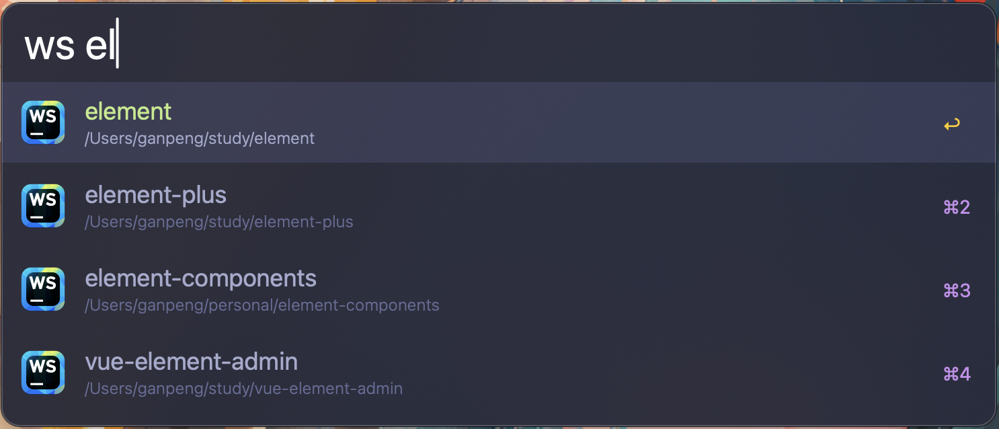
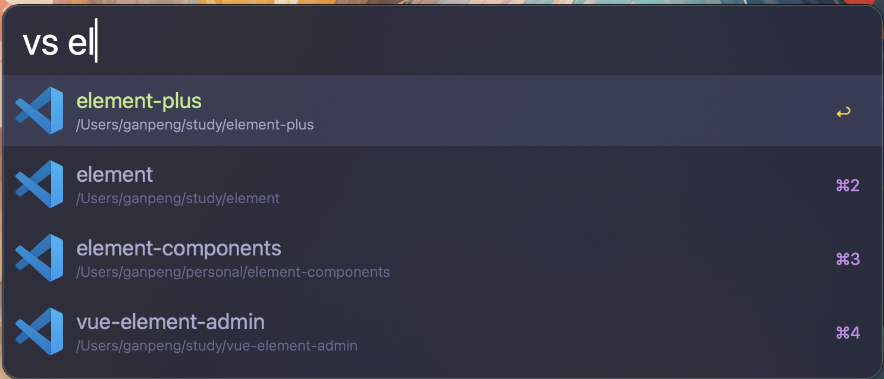

# alfred-open-in-jetbrains 

> Open the project in Jetbrains or VSCode by Alfred

## Install

- ` npm install --global open-by-alfred `
- Configure workflow in Alfred, e.g. `~/xxx,~/yyy,~/zzz`

*Requires [Node.js](https://nodejs.org) 4+ and the Alfred [Powerpack](https://www.alfredapp.com/powerpack/).*

## Usage

In Alfred, type `ws`, <kbd>Enter</kbd>, and your query.

## License

MIT © [ganpeng](https://github.com/gp0119/alfred-open-in-jetbrains)
